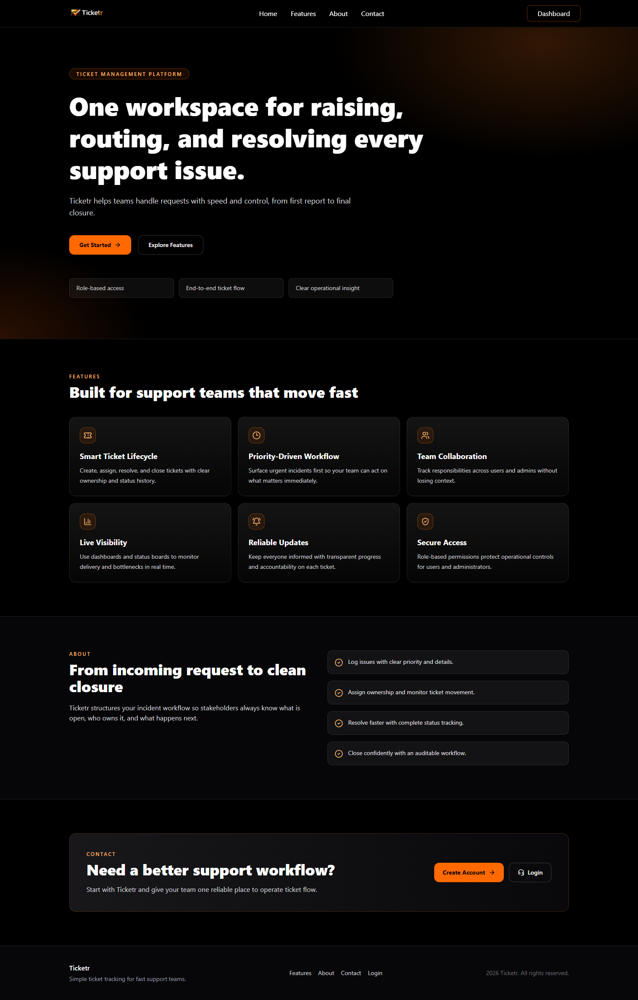
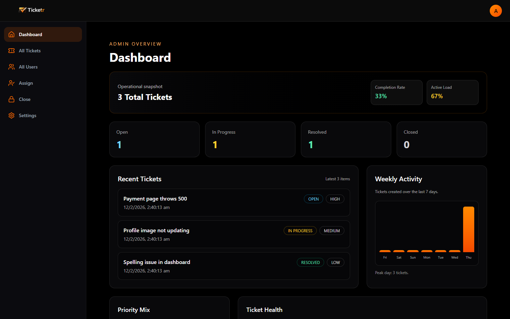
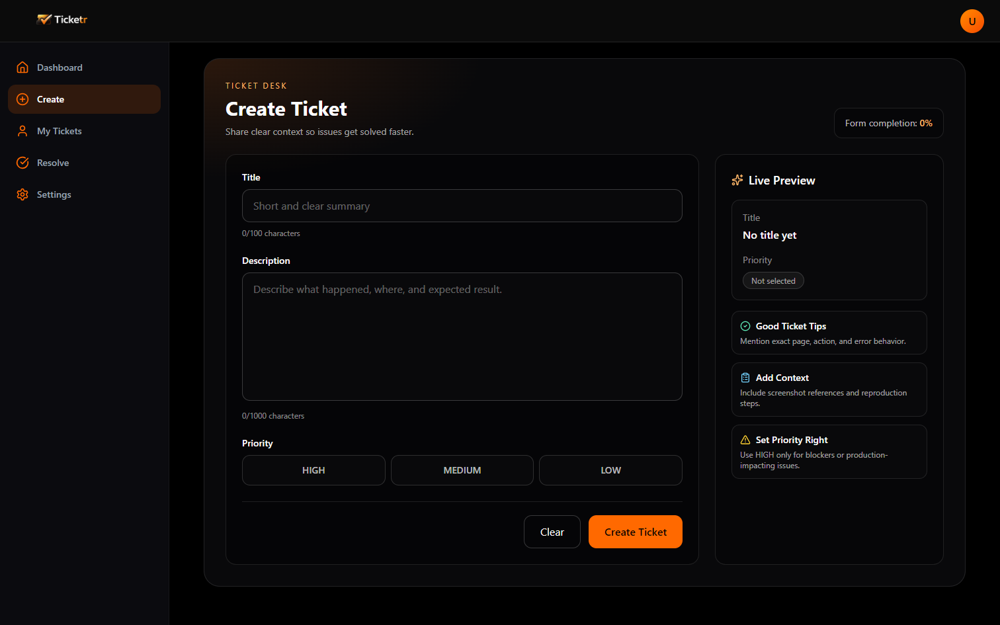
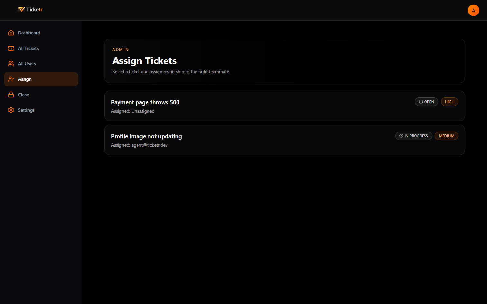

# Ticketr

Modern full-stack ticket management system with role-based access, JWT cookie authentication, and a clean dashboard workflow for both users and admins.


## Table of Contents

1. [Overview](#overview)
2. [Features](#features)
3. [Tech Stack](#tech-stack)
4. [Project Structure](#project-structure)
5. [Ticket Lifecycle](#ticket-lifecycle)
6. [Screenshots (SS)](#screenshots-ss)
7. [Getting Started](#getting-started)
8. [Environment Variables](#environment-variables)
9. [API Endpoints](#api-endpoints)
10. [Run Tests](#run-tests)
11. [Deployment Notes](#deployment-notes)
12. [Troubleshooting](#troubleshooting)

## Overview

Ticketr is a monorepo with:

- `ticketr-backend`: Spring Boot REST API (JWT auth via `HttpOnly` cookie + MySQL + role-based authorization).
- `ticketr-frontend`: React + Vite UI with protected routes, role-aware navigation, and dashboard analytics.

Roles supported:

- `USER`: Register, create tickets, view own/assigned tickets, resolve assigned work.
- `ADMIN`: View all tickets, assign ownership, close resolved tickets, list all users.

## Features

- Secure login/register flow with JWT stored in `access_token` cookie.
- Role-based route and API protection (`USER`, `ADMIN`).
- Ticket states: `OPEN -> IN_PROGRESS -> RESOLVED -> CLOSED`.
- Priority support: `LOW`, `MEDIUM`, `HIGH`.
- Admin panels for all tickets, assignment, closing, and user directory.
- User panels for ticket creation, personal tickets, and ticket resolution.
- Dashboard with status, priority, and weekly activity insights.
- OpenAPI docs with Swagger UI.

## Tech Stack

Backend:

- Java 17
- Spring Boot 3.4.1
- Spring Security + Method Security
- Spring Data JPA
- MySQL
- JWT (`jjwt`)
- Swagger/OpenAPI (`springdoc-openapi`)

Frontend:

- React 19
- Vite 7
- React Router 7
- Axios
- Tailwind CSS 4
- `react-hot-toast`

## Project Structure

```text
Ticketr/
|- ticketr-backend/
|  |- src/main/java/com/app/ticketr_backend/
|  |  |- controller/
|  |  |- service/
|  |  |- repository/
|  |  |- security/
|  |  |- model/
|  |  |- dto/
|  |  |- exception/
|  |- src/main/resources/application.properties
|  |- pom.xml
|
|- ticketr-frontend/
|  |- src/
|  |  |- api/
|  |  |- component/
|  |  |- context/
|  |  |- layouts/
|  |  |- page/
|  |  |- routes/
|  |- package.json
|
|- README.md
```

## Ticket Lifecycle

1. `USER` creates ticket (`OPEN`).
2. `ADMIN` assigns ticket to a user (`IN_PROGRESS`).
3. Assigned user resolves ticket (`RESOLVED`).
4. `ADMIN` closes verified ticket (`CLOSED`).

Business rules enforced in backend service layer:

- Only `OPEN` tickets can be assigned.
- Only assigned user can resolve a ticket.
- Only `RESOLVED` tickets can be closed.

## Screenshots (SS)

Current assets in repo include logo only. Add product screenshots under a folder like `docs/ss/` and link them below.

Example section you can keep/update:

```md
## Screenshots (SS)

### Home


### User Dashboard


### Admin Dashboard


### Create Ticket


### Assign Ticket

```

## Getting Started

Prerequisites:

- Node.js 18+
- Java 17+
- MySQL 8+
- Maven (or use provided Maven wrapper)

### 1. Clone

```powershell
git clone <your-repo-url>
cd Ticketr
```

### 2. Configure MySQL

Create database:

```sql
CREATE DATABASE ticketr;
```

Update backend DB credentials in `ticketr-backend/src/main/resources/application.properties`.

### 3. Start Backend

```powershell
cd ticketr-backend
.\mvnw.cmd spring-boot:run
```

Backend default URL: `http://localhost:8080`

Swagger UI: `http://localhost:8080/swagger-ui/index.html`

### 4. Configure Frontend

Create `ticketr-frontend/.env`:

```env
VITE_API_URL=http://localhost:8080/api
```

### 5. Start Frontend

```powershell
cd ticketr-frontend
npm install
npm run dev
```

Frontend default URL: `http://localhost:5173`

## Environment Variables

Frontend (`ticketr-frontend/.env`):

- `VITE_API_URL`: Backend API base URL including `/api`.

Backend (`application.properties`):

- `spring.datasource.url`
- `spring.datasource.username`
- `spring.datasource.password`
- `jwt.secret`
- `jwt.expiration`

Important: move sensitive values (`jwt.secret`, DB password) to environment variables or secrets manager in production.

## API Endpoints

Base path: `/api`

Auth:

- `POST /auth/register` - Register user (default role `USER`).
- `POST /auth/login` - Login and set `access_token` cookie.
- `GET /auth/me` - Get current authenticated user details.
- `POST /auth/logout` - Clear auth cookie.

Users:

- `GET /users` - List all users (`ADMIN` only).

Tickets:

- `POST /tickets/create` - Create ticket (`USER`).
- `GET /tickets/my` - Get tickets created by current user (`USER`).
- `GET /tickets/assigned` - Get tickets assigned to current user (`USER`).
- `GET /tickets` - Get paginated tickets, optional `status` and `priority` filters (`ADMIN`).
- `PUT /tickets/{ticketId}/assign/{userId}` - Assign ticket (`ADMIN`).
- `PUT /tickets/{ticketId}/resolve` - Mark ticket resolved (`USER`, assigned user only).
- `PUT /tickets/{ticketId}/close` - Close ticket (`ADMIN`).

## Run Tests

Backend:

```powershell
cd ticketr-backend
.\mvnw.cmd test
```

Frontend lint:

```powershell
cd ticketr-frontend
npm run lint
```

## Deployment Notes

- Backend CORS currently allows:
  - `https://ticketrapp.vercel.app`
  - `http://localhost:5173`
  - `http://localhost:8080`
- Update allowed origins in `SecurityConfig` for your production domains.
- Use HTTPS in production.
- Secure `jwt.secret` and database credentials outside source control.

## Troubleshooting

- 401/403 from frontend:
  - Check backend is running and `VITE_API_URL` is correct.
  - Verify login succeeded and cookie is present.
- CORS issues:
  - Ensure frontend origin is included in backend CORS config.
- DB connection errors:
  - Verify MySQL service is running and credentials/database match properties.
- Empty admin pages:
  - Confirm logged-in account has `ADMIN` role in database.

---

Built with Spring Boot + React for practical ticket workflow management.
